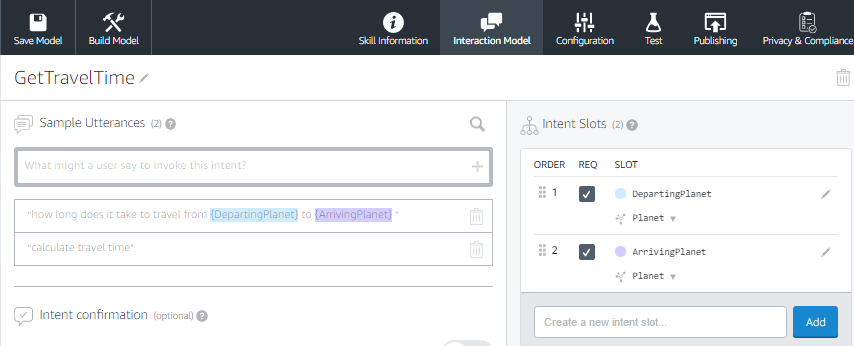

# Build An Alexa Fact Skill
[](1-voice-user-interface.md)[](2-lambda-function.md)[](3-connect-vui-to-code.md)[](4-testing.md)

## Setting up Your Alexa Skill in the Developer Portal

There are two parts to an Alexa skill.  The first part is the [Voice User Interface (VUI)](https://developer.amazon.com/public/solutions/alexa/alexa-skills-kit/docs/defining-the-voice-interface) that is defined by an interaction model.  This is where we define how we will handle a user's voice input, and which code should be executed when specific commands are uttered.  The second part is the actual code and logic for our skill. The code and logic will be handled when setting up the lambda function.

1.  Go to the [Amazon Developer Portal](http://developer.amazon.com).  In the top-right corner of the screen, click the **Sign In** button. If you don't already have an account, you will be able to create a new one for free.

    <a href="http://developer.amazon.com" target="\_blank"></a>

2.  Once you have signed in go into the **Developer Console** and click the Alexa button at the top of the screen.

    <a href="https://developer.amazon.com/edw/home.html#/" target="\_blank"></a>

3.  On the Alexa page, choose the **Get Started** button for the Alexa Skills Kit.

    <a href="https://developer.amazon.com/edw/home.html#/skills/list" target="\_blank"></a>

4.  Select **Add A New Skill**. This will get you to the first page of your new Alexa skill.

    <a href="https://developer.amazon.com/edw/home.html#/skill/create/" target="\_blank"></a>

5.  Fill out the **Skill Information** screen. Make sure to review the tips we provide below the screenshot.

    

    #### Skill Information Tips
    1.  **Skill Type** For this skill, we are creating a skill using the Custom Interaction Model.  This is the default choice.

    2.  **Language** Choose the first language you want to support.  You can add additional languages in the future, but we need to start with one.  (This guide is using U.S. English to start.)

    3.  **Name** This is the name that will be shown in the Alexa Skills Store, and the name your users will refer to. As an example, you can use ```Sample Fact Skill - C#```.

    4.  **Invocation Name** This is the name that your users will need to say to start your skill.  We have provided some common issues developers encounter in the list below, but you should also review the entire [Invocation Name Requirements](https://developer.amazon.com/public/solutions/alexa/alexa-skills-kit/docs/choosing-the-invocation-name-for-an-alexa-skill). As an example, you can use ```Sample Fact Skill```.

        | Invocation Name Requirements | Examples of incorrect invocation names |
        | ---------------------------- | -------------------------------------- |
        | The skill invocation name must not infringe upon the intellectual property rights of an entity or person. | korean air; septa check |
        | Invocation names should be more than one word (unless it is a brand or intellectual property), and must not be a name or place | horoscope; trivia; guide; new york |
        | Two word invocation names are not allowed when one of the words is a definite article, indefinite article, or a preposition | any poet; the bookie; the fool |
        | The invocation name must not contain any of the Alexa skill launch phrases and connecting words.  Launch phrase examples include "launch," "ask," "tell," "load," and "begin."  Connecting word examples include "to," "from," "by," "if," "and," "whether." | trivia game for star wars; better with bacon |
        | The invocation name must not contain the wake words "Alexa," "Amazon," "Echo," or the words "skill" or "app." | hackster initial skill; word skills |
        | The invocation name must be written in each language you choose to support.  For example, the German version of your skill must have an invocation name written in German, while the English (US) version must have an invocation name written in English. | kitchen stories (German skill) |

    5.  **Audio Player**, **Video App**, **Render Template** For this Fact skill, we won't be using any other types of directives, so you can select **No** for the other options.  If you would like to learn more about adding audio to your skills, please check out our [Audio Player Guide](https://github.com/alexa/skill-sample-nodejs-audio-player).

6.  Click the **Save** button and then click the **Next** to move to the Interaction Model.

    
    

7.  Click on the **Launch Skill Builder** (Beta) button. This will launch the new Skill Builder Dashboard.

    

8.  Click on the **Add+** button near __Intents__ on the top left corner of the dashboard.

    

9.  In the textbox provided, enter the new intent name: **GetNewFactIntent**, and click the **Create Intent** button.

    

10. Add sample utterances for your intent. These are the things a user would say to make this intent happen. Here are a few examples:

    * Space fact
    * Tell me a fact
    * Tell me something
    * Tell me a space fact
    * Give me a space fact
    * Give me a fact

    

11. Click on the **Save Model** button, and then click on the **Build Model** button.

    

    If the model builds successfully we can move on and add more Intents to the application in step 12. If you get an error from the Interaction Model then check the following::

    * Did you copy and paste the provided code into the appropriate boxes?
    * Did you accidentally add any characters to the Interaction Model or Sample Utterances?
    <br/>

    > OPTIONAL: You can choose to upload a file to fill out your interaction model. To do that for this sample click on the </> Code Editor tab and drag the JSON file, _InteractionModel.json_, from the speech-assets folder of the sample code to the cloud upload icon. Once you're done, click Apply Changes.

        

12. Click on the "Add+" button near **Intents** on the top left corner of the dashboard.

    

    In the textbox provided enter the new intent name, **GetJoke**, and click the **Create Intent** button.

    

13. Add some sample utterances for your intent. These are the things a user would say to make the **GetJoke** intent happen. Here are a few possible examples:

      * Tell me a joke
      * Next joke
      * A joke please
      * Give me a joke
      * Make me laugh

      Click the **Save Model** button to save your data, don't click the **Build Model** button just yet as we have more Intents to configure.

      

14. We will now create the "GetTravelTime" custom intent. Click **Add Intent** as described above and enter **GetTravelTime** then click the **Create Intent** button. Now add some utterances for the GetTravelTime intent, enter the following:

    * calculate travel time
    * how long does it take to travel from {DepartingPlanet} to {ArrivingPlanet}

    Click **Save Model**.

      Notice the Intent Slots panel has the new slots that were created while adding utterances. Tick the DepartingPlanet and ArrivingPlanet checkboxes to indicate that these are required slots.

      

15. Next we will create a custom slot type called **Planet** which will contain a list of all the planets the user can travel too. Whenever possible choose from one of the built in slot types as those are already trained for you. To create a custom slot type, look for the **Slot Types** section on the navigation panel and choose ```ADD+``` to bring up the Add Slot Type page.

    

    

    Type **Planet** as the slot name then click the **Create Slot Type** button and enter the following slot values:

    ```
    Mercury
    Venus
    Earth
    Mars
    Jupiter
    Saturn
    Uranus
    Neptune
    Pluto
    ```

16. Now set the slot type for the DepartingPlanet and ArrivingPlanet Intent Slots to the **Planet** slot type just created. Under the **Intent Slots** panel on the left click the **Edit** icon to display the **DepartingPlanet** Intent Slot details window.  From the **Slot Type** dropdown select **Planet**. Repeat the above for the **ArrivingPlanet**.

    Click **Save Model**.

    If the model saves successfully, move on to the next step. If you get an error from the such as _Bad Request_, check that you properly assigned the **DepartingPlanet** and **ArrivingPlanet** Slot Types to **Planet**.

17. Next we'll add **Prompts** and **Utterances** to both the DepartingPlanet and ArrivingPlanet Intent Slots. Open the Intent Slot details windows for DepartingPlanet as above. Set the **Is this slot required to fulfill the intent** option to **YES**. Add the prompts that Alexa will employ to request the DepartingPlanet from user, enter the following as a prompt:

    * Which planet are you starting from?

    followed by the list of utterances that users might respond with:

    * I'm starting from {DepartingPlanet}
    * {DepartingPlanet}
    * I'm going from {DepartingPlanet} to {ArrivingPlanet}

    Click **Save Model**.

    > Notice that you can enable the user to over answer with other slot values. That helps the experience to be more conversational rather than feeling like a wizard.

    Leave **Does this slot require confirmation?** set to **NO**. You would set this to YES if Alexa was needed to say something like "Are you sure?" after gathering the slot value. This approach will be demonstrated in the GetWeather Intent.

    Now repeat for the ArrivingPlanet Intent Slot. Set the **Is this slot required to fulfill the intent** radio button to **YES**. Add the following prompt text:

    * Which planet are you going to?

    then add the utterances that users might respond with:

    * {ArrivingPlanet}
    * I'm going to {ArrivingPlanet}

    As before, leave Slot Confirmation set to **NO**.

    Click **Save Model**.

19. Create and configure the **GetWeather** Intent. As before, add a new Intent and call it **GetWeather**, then add utterances such as:

    * Tell me weather
    * Weather at {Planet}
    * Tell me weather at {Planet}
    * What is weather
    * What is weather at {Planet}

    Next, edit the Intent Slot called **Planet** that has been created in the Intent Slots panel on the left of the display by clicking the **Edit icon**. In the Slot Type dropdown select **Planet**. Set the **Is this slot required to fulfill the intent** option to **YES**. Then enter the following strings in the **Prompts** field:

    * Weather at which planet?
    * Which planet?
    * Which planet's weather do you want to know?

    In the **Slot Confirmation** panel set the **Does this slot require confirmation?** option to **YES**. Then add the following text to the prompts field:

    * Are you certain?
    * Do you want to know the weather at {Planet}?

    These prompts will allow Alexa to query the user after gathering the slot value.

20. We have now finished configuring the **GetWeather** Intent. Click on **Save Model** to save your data, then click **Build Model** to build it. It may take a few minutes for the model to build, when finished click **Configuration** to move to Configuration.

    

    If you get an error from your interaction model, check through this list:
    * Did you copy & paste the provided code into the appropriate boxes?
    * Did you accidentally add any characters to the Interaction Model or Sample Utterances?

    In the next step of this guide, we will create our Lambda function in the AWS developer console but keep Amazon Developer Console available as you will return to it in a later step.

<br/><br/>
<a href="2-lambda-function.md"></a>
