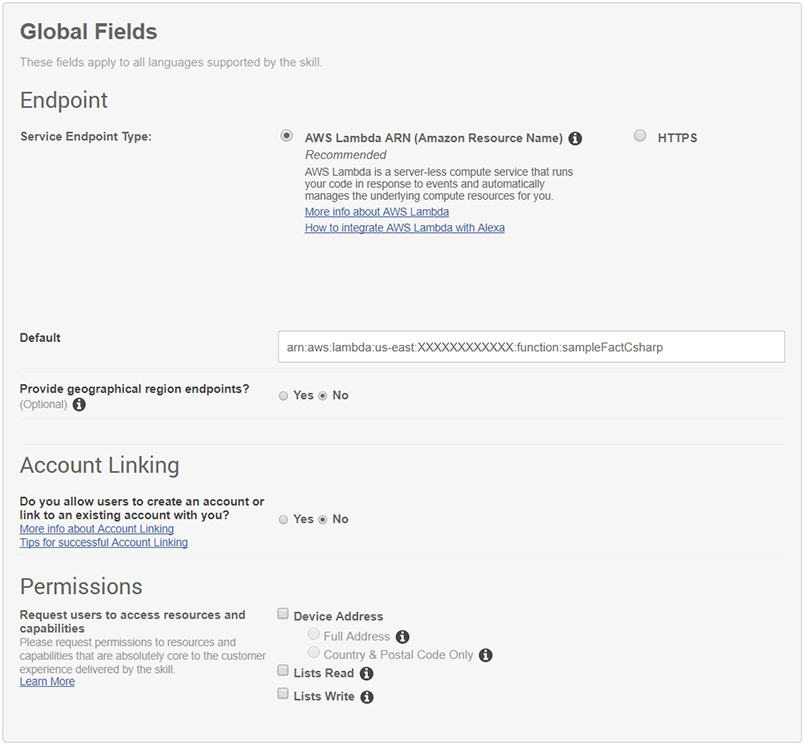

# Build An Alexa Fact Skill

## Connecting Your Voice User Interface To Your Lambda Function

In the first step of this guide, you created a voice user interface for the intents and utterances we expect from our users.  You then configured and uploaded C# Lambda function that contains all of our logic for the skill.  On this page, you will connect those two pieces together.

1.  Go back to the [Amazon Developer Portal](https://developer.amazon.com/edw/home.html#/skills/list) and select the _Sample Fact Skill - C#_ skill from the list. You may still have a browser tab open if you started at the beginning of this tutorial.

2.  Open the **Configuration** tab on the left side.

    

3.  Select the **AWS Lambda ARN (Amazon Resource Name)** option for your endpoint. You have the ability to host your code anywhere that you would like but this sample uses AWS Lambda. ([Read more about Hosting Your Own Custom Skill Web Service](https://developer.amazon.com/public/solutions/alexa/alexa-skills-kit/docs/developing-an-alexa-skill-as-a-web-service).).

4.  Select **No** for **Provide geographical region endpoints?**. If you use _Europe_ as your geographical region, make sure you select the same region that you created your Lambda in. Alexa skills using AWS Lambda for the United States run in N. Virginia (North America) and run in Ireland (Europe) for Europe.

    

5.  Paste your Lambda's ARN (Amazon Resource Name) into the **Default** textbox provided. It should look similar to the screenshot above and it should be everything after the "ARN-" so it's: arn:aws:lambda:us-east:XXXXXXXXXXXX:function:sampleFactCsharp

6.  Leave **Account Linking** set to **No**. For this skill, we won't be using Account Linking, but you can learn more about [Linking an Alexa User with a User in Your System.](https://developer.amazon.com/public/solutions/alexa/alexa-skills-kit/docs/linking-an-alexa-user-with-a-user-in-your-system)

  

